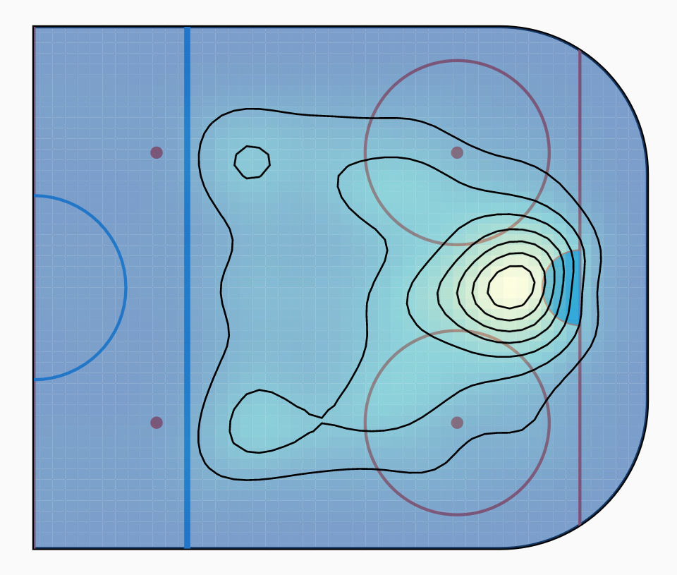

# Flutter Density Charts

Density charts built in Flutter with the help of Python.

# Getting Started

The [following article](https://medium.com/@d.panaite92/drawing-charts-in-flutter-dealing-with-large-datasets-in-small-spaces-463dfa61a7f2) should help you get a good understanding on how the density chart painters can be used. The code used in the article can be found in the `example` project.

# Python Requirements

A Python Flask server was used to generate the KDE/contour data from raw data. While this is required to get the example contour chart rendered, the flutter_density_chart library works independently of the back-end. Pre-generated KDE/contour data can be directly passed into the chart painters.